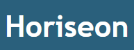

<!--
*** This is the Readme for the Horseon Web site project
*** Bootcamp challange to make more optimized 
-->

<!-- Project Shields -->
[![Forks][forks-shield]][forks-url]
[![Stargazers][stars-shield]][stars-url]
[![MIT License][license-shield]][license-url]
[![LinkedIn][linkedin-shield]][linkedin-url]

<!-- Project Logo -->
 

    <a href="https://github.com/aaguirre7/horiseon-seo">
        
    <a/>
    <h3 align="center">
        Horseon SEO website
    </h3>
    

        A code refractor Challange for the Bootcamp Training
         
        <a href="https://github.com/aaguirre7/horiseon-seo">
            <strong>Explore the docs</strong>
        </a>
         
         
        <a href="https://aaguirre7.github.io/horiseon-seo/">
            View the site
        </a>
    

<!-- MARKDOWN LINKS & IMAGES -->
[forks-shield]: https://img.shields.io/github/forks/othneildrew/Best-README-Template.svg?style=for-the-badge
[forks-url]: https://github.com/aaguirre7/horiseon-seo/network/members
[stars-shield]: https://img.shields.io/github/stars/othneildrew/Best-README-Template.svg?style=for-the-badge
[stars-url]: hhttps://github.com/aaguirre7/horiseon-seo/stargazers
[license-url]: https://github.com/othneildrew/Best-README-Template/blob/master/LICENSE.txt
[linkedin-shield]: https://img.shields.io/badge/-LinkedIn-black.svg?style=for-the-badge&logo=linkedin&colorB=555
[linkedin-url]: https://www.linkedin.com/in/abraham-aguirre-1b237293/
[product-screenshot]: ./assets/images/01-html-css-git-homework-demo.png